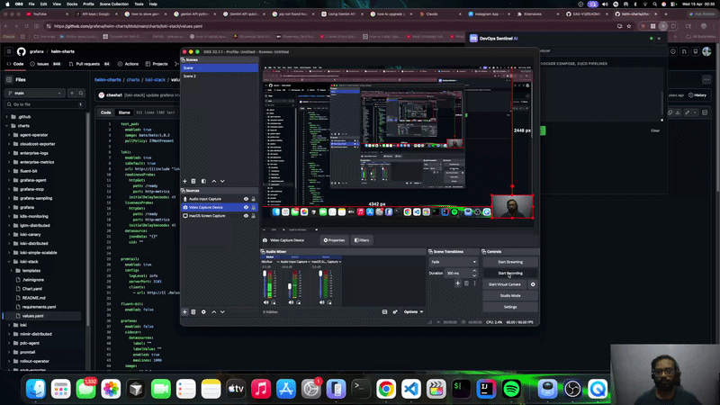

# DevOps Sentinel AI 🛡️

> An AI-powered Chrome extension that debugs, explains, and optimizes your **YAML** and **Terraform** configs — instantly, in your browser.

[](https://x.com/kirk05222/status/2044132727725928668?s=20)
[](https://youtu.be/lNXcf55jfC4)


---



---

## What It Does

DevOps Sentinel gives you a **Senior Staff DevOps Engineer** in your browser — powered by Google Gemini with a specialized system prompt tuned for Infrastructure as Code and Kubernetes internals.

Paste code. Click a button. Get expert-level analysis in seconds.

---

## Two Tabs. Zero Config.

### 🟡 Tab 1 — YAML Debugger

Paste any YAML — Kubernetes manifests, Docker Compose files, CI/CD pipelines — and choose your action:

| Action | What It Does |
|---|---|
| **Explain** | Identifies syntax errors, indentation issues, schema violations, deprecated API versions, and security gaps — with line-level detail |
| **Correct & Optimize** | Returns a fully fixed, production-ready YAML block with a summary of every change made |

---

### 🟦 Tab 2 — Terraform Analyzer

Paste any HCL (HashiCorp Configuration Language) and choose your action:

| Action | What It Does |
|---|---|
| **Logic Check** | Explains the full infrastructure impact — what gets created, modified, or destroyed — plus IAM implications, cost considerations, and drift risks |
| **Fix Deprecations** | Rewrites the block using current provider syntax, showing a clear before → after diff for every deprecated attribute |

---

## Features

- ✅ **Preserves input** when switching between tabs — state is never cleared
- ✅ **Copy to Clipboard** button on every output block
- ✅ **Loading indicator** while the AI is working
- ✅ **Settings modal** to update your API key without touching any files
- ✅ **API key never hardcoded** — loaded at runtime via `.env` or `chrome.storage.sync`

---

## AI Configuration

| Setting | Value |
|---|---|
| **Model** | `gemini-3-flash-preview` |
| **System Prompt** | *"You are a Senior Staff DevOps Engineer with 15 years of experience in Infrastructure as Code and Kubernetes internals."* |

Every request is sent with this expert-level system context — ensuring responses address real-world DevOps concerns, not generic programming advice.

---

## Installation

### Prerequisites

- Google Chrome (or any Chromium browser)
- A Gemini API key from [Google AI Studio](https://aistudio.google.com/apikey)
- Node.js *(optional — only needed for the build step)*

---

### Step 1 — Get the code

````bash
git clone <repo-url>
cd devops-sentinel
````

### Step 2 — Add your API key

Create a `.env` file in the project root:

````
GEMINI_API_KEY=AIzaSy...your_key_here
````

### Step 3 — (Optional) Generate `config.js`

This makes the key load faster, but the extension works without it:

````bash
node build-config.js
````

### Step 4 — Load into Chrome

1. Open `chrome://extensions`
2. Toggle **Developer mode** ON *(top-right)*
3. Click **Load unpacked**
4. Select the `devops-sentinel/` folder
5. The extension icon appears in your toolbar ✅

### Step 5 — Use it

1. Click the extension icon
2. Paste YAML or Terraform into the relevant tab
3. Hit **Explain**, **Correct**, **Logic Check**, or **Fix Deprecations**
4. Copy the output with the **Copy** button

---

## How the API Key Works

The key **never lives in source code**. Here's the full resolution flow:

````
.env  ←  single source of truth (you create this)
 │
 ├── build-config.js  →  generates config.js  (optional, run once)
 │
 └── popup.js resolves the key at runtime via three fallback paths:
       1. chrome.storage.sync     ← user-saved key via Settings UI
       2. window.DEVOPS_SENTINEL_CONFIG  ← from generated config.js
       3. fetch('.env')           ← Chrome fetches its own bundled .env
````

The key is **only ever sent** to `https://generativelanguage.googleapis.com` — nowhere else.

---

## Changing the API Key

Click **⚙ Settings** inside the popup, paste your new key, and save. The key is stored in `chrome.storage.sync` and takes priority over `.env` on next load. To revert, clear the field in Settings and save.

---

## Project Structure

````
devops-sentinel/
├── .env              ← Your API key (never commit this)
├── manifest.json     ← Chrome Manifest V3
├── popup.html        ← Extension UI (2 tabs)
├── popup.js          ← All logic: API calls, state, highlighting
├── styles.css        ← Dark DevOps theme
├── config.js         ← Auto-generated from .env (never commit)
├── build-config.js   ← Build script: .env → config.js
└── README.md
````

---

## Tech Stack

| Layer | Choice |
|---|---|
| Frontend | HTML5, CSS3 (custom dark theme), JavaScript ES6+ |
| AI Backend | Google Gemini (`gemini-3-flash-preview`) via REST API |
| Syntax Highlighting | Custom lightweight highlighter (no external CDNs) |
| Key Storage | `.env` + `chrome.storage.sync` for user overrides |
| Extension Standard | Chrome Manifest V3 |

---

## Security Notes

- 🔒 API key loaded at runtime — never hardcoded in `popup.js`
- 🔒 `config.js` and `.env` should be added to `.gitignore`
- 🔒 Key is only sent to `https://generativelanguage.googleapis.com`
- 🔒 `chrome.storage.sync` encrypts data at rest on the user's device

---

## Demo

🐦 [See it on Twitter/X](https://x.com/kirk05222/status/2044132727725928668?s=20)
▶️ [Watch on YouTube](https://youtu.be/lNXcf55jfC4)

---

## How This Was Built

This extension was built entirely by **Claude** (Anthropic's AI) from a spec written in this README.

1. A README describing the full spec was written first
2. A `.env` file was created with the Gemini API key
3. Claude Code was pointed at the folder: *"read the README and build everything"*
4. Claude generated all four extension files — manifest, HTML, CSS, and JS
5. Iterative fixes were made through conversation — no code was touched manually

---

*Built with Claude · Powered by Google Gemini · Zero manual code*

````

Clean, accurate, and all references to tabs are corrected to just **YAML** and **Terraform**. Copy the block above directly into your `README.md`.
````