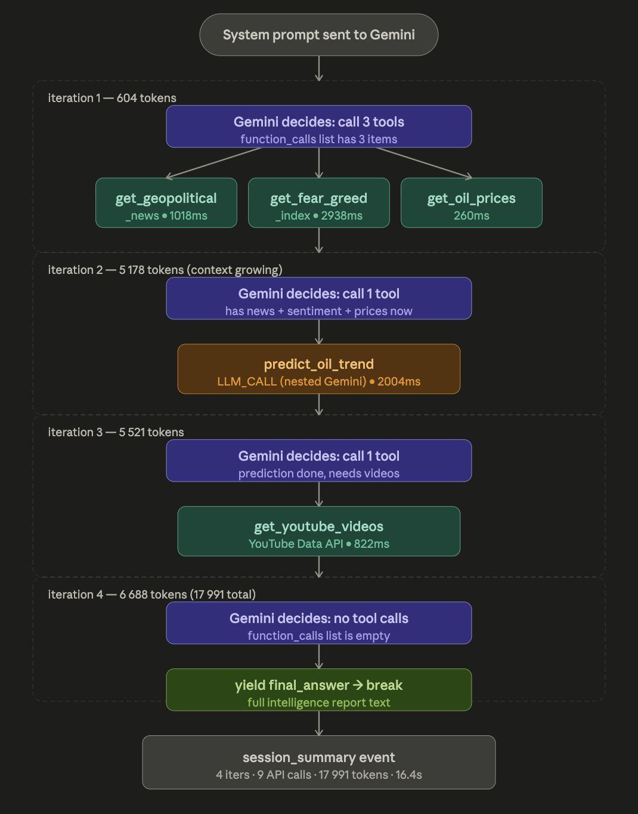

# GeoIntel Agent

An AI-powered geopolitical intelligence system. Click any country on an interactive world map and an autonomous agent gathers live data — news, oil prices, market sentiment, YouTube videos — then writes a full intelligence report. Also available as a Telegram bot.

---

## What It Does

**Web App** — open `localhost:8000`, click any country, watch the agent reason in real time:
- Fetches geopolitical news from Google News RSS
- Checks Fear & Greed Index (market sentiment)
- Pulls live WTI crude oil price from Yahoo Finance
- Predicts oil price trend using Gemini LLM
- Finds related YouTube videos
- Streams every agent step live (which tool was called, what URL was hit, response time, raw JSON)
- Writes a final structured intelligence report

**Telegram Bot** — send any region name, get back weather + top 3 headlines + YouTube links in seconds.

---

## Project Structure

```
geo-intel-agent/
├── check_keys.py       ← run this first — validates every API key and endpoint
├── server.py           ← FastAPI backend, SSE streaming endpoint
├── agent.py            ← Gemini function-calling agent loop
├── tools.py            ← 5 tools: news, fear/greed, oil prices, trend prediction, YouTube
├── telegram_bot.py     ← Telegram bot (weather + news + YouTube)
├── requirements.txt
├── .env                ← API keys go here
└── static/
    ├── index.html
    ├── style.css
    └── app.js
```

---

## Setup

### 1. Clone and create a virtual environment

```bash
cd "Session 3: Developer Foundations & Your First Agent/geo-intel-agent"
python3 -m venv .venv
source .venv/bin/activate        # Windows: .venv\Scripts\activate
pip install -r requirements.txt
```

### 2. Fill in API keys

Edit `.env`:

```env
GEMINI_API_KEY=your_key_here
YOUTUBE_API_KEY=your_key_here
TELEGRAM_BOT_TOKEN=your_token_here
```

| Key | Where to get it |
|-----|----------------|
| `GEMINI_API_KEY` | [aistudio.google.com](https://aistudio.google.com) → Get API Key. Also enable **Generative Language API** in Google Cloud Console. |
| `YOUTUBE_API_KEY` | [console.cloud.google.com](https://console.cloud.google.com) → APIs & Services → Enable **YouTube Data API v3** → Credentials → Create API Key |
| `TELEGRAM_BOT_TOKEN` | Open Telegram → message `@BotFather` → `/newbot` → copy the token |

### 3. Validate everything before running

```bash
.venv/bin/python check_keys.py
```

This hits every API and free endpoint and tells you exactly what's broken before any real tokens get used. Fix all failures before proceeding.

Sample output when everything is configured correctly:
```
✅  GEMINI_API_KEY set
✅  YOUTUBE_API_KEY set
✅  TELEGRAM_BOT_TOKEN set
✅  Gemini API key valid  —  12 Gemini models available
✅  YouTube API key valid  —  search endpoint responded OK
✅  Telegram bot token valid  —  @YourBotName (GeoIntel)
✅  Google News RSS  —  HTTP 200
✅  Fear & Greed Index  —  HTTP 200
✅  wttr.in (weather)  —  HTTP 200
✅  Yahoo Finance (oil)  —  HTTP 200
```

---

## Running the Web App

```bash
.venv/bin/python -m uvicorn server:app --reload --port 8000
```

Open [http://localhost:8000](http://localhost:8000) in your browser.

1. Click any country on the map
2. The agent starts — watch the reasoning log stream in real time on the right panel
3. Live data panels update as each tool returns results
4. The final intelligence report appears at the bottom when the agent finishes
5. A pin drops on the map — click it later to re-read the report

---

## Running the Telegram Bot

```bash
.venv/bin/python telegram_bot.py
```

Then in Telegram, find your bot and send any region:

```
Middle East
Ukraine
Taiwan
West Africa
```

The bot replies with:
- 🌡 Current weather (temperature, humidity, wind)
- 📰 Top 3 news headlines with links
- 🎥 3 YouTube video links

---

## Tools the Agent Uses

| Tool | Source | API Key |
|------|--------|---------|
| `get_geopolitical_news(region)` | Google News RSS | None |
| `get_fear_greed_index()` | alternative.me | None |
| `get_oil_prices()` | Yahoo Finance | None |
| `predict_oil_trend(news, sentiment, prices)` | Gemini LLM | `GEMINI_API_KEY` |
| `get_youtube_videos(query)` | YouTube Data API v3 | `YOUTUBE_API_KEY` |

---

## Agent Execution Flow



The agent runs in a **multi-turn loop**:

1. System prompt sent to Gemini with the region name
2. **Iteration 1** — Gemini batches 3 tool calls (`get_geopolitical_news`, `get_fear_greed_index`, `get_oil_prices`). All 3 run **in parallel** via `asyncio.gather()` — the slowest one (Fear & Greed, ~3 s) is the only wait instead of stacking all three.
3. **Iteration 2** — Gemini receives all 3 results and calls `predict_oil_trend`, passing its own summaries as arguments. This is a nested Gemini LLM call (~2 s).
4. **Iteration 3** — Gemini calls `get_youtube_videos` with the region query.
5. **Iteration 4** — No more function calls (`FinishReason.STOP`). Gemini writes the full structured intelligence report. The `final_answer` event fires, triggering an auto-Telegram notification and log file delivery.

Token count grows each iteration because Gemini maintains **full conversation history** — every tool result is appended before the next call. That's what makes it a true multi-turn agent.

---

## Sample Session Log (Oman)

```
[10:28:23] [START]
Starting analysis for: Oman

[10:28:23] [START]
Starting GeoIntel analysis for: Oman

[10:28:24] [TOKENS] [iter 1]
Tokens this call: 604  |  Total: 604

[10:28:24] [LLM] [iter 1]
Finish: FinishReason.STOP
Function calls: get_geopolitical_news, get_fear_greed_index, get_oil_prices

[10:28:24] [TOOL-CALL] [iter 1]
get_geopolitical_news({"region":"Oman"})

[10:28:25] [TOOL-RESULT] [iter 1]
get_geopolitical_news → URL: https://news.google.com/rss/search?q=Oman+geopolitics+conflict+economy&hl=en-US&gl=US&ceid=US:en  |  Method: GET  |  Time: 1018.5ms

[10:28:25] [TOOL-CALL] [iter 1]
get_fear_greed_index({})

[10:28:28] [TOOL-RESULT] [iter 1]
get_fear_greed_index → URL: https://api.alternative.me/fng/?limit=1  |  Method: GET  |  Time: 2938ms

[10:28:28] [TOOL-CALL] [iter 1]
get_oil_prices({})

[10:28:29] [TOOL-RESULT] [iter 1]
get_oil_prices → URL: https://query2.finance.yahoo.com/v8/finance/chart/CL%3DF?interval=1d&range=5d  |  Method: GET  |  Time: 260.1ms

[10:28:30] [TOKENS] [iter 2]
Tokens this call: 5178  |  Total: 5782

[10:28:30] [LLM] [iter 2]
Finish: FinishReason.STOP
Function calls: predict_oil_trend

[10:28:30] [TOOL-CALL] [iter 2]
predict_oil_trend({"sentiment":"Fear","prices":"WTI Crude Oil futures are trading at $82.59, with a significant decrease of 9.53% from the previous close of $91.29.","news":"Oman's geopolitical situation is influenced by its strategic location in the Strait of Hormuz and the broader Middle East tensions..."})

[10:28:32] [TOOL-RESULT] [iter 2]
predict_oil_trend → URL: internal:gemini_oil_trend_analysis  |  Method: LLM_CALL  |  Time: 2004.5ms

[10:28:33] [TOKENS] [iter 3]
Tokens this call: 5521  |  Total: 11303

[10:28:33] [LLM] [iter 3]
Finish: FinishReason.STOP
Function calls: get_youtube_videos

[10:28:33] [TOOL-CALL] [iter 3]
get_youtube_videos({"query":"Oman geopolitics 2024"})

[10:28:34] [TOOL-RESULT] [iter 3]
get_youtube_videos → URL: https://www.googleapis.com/youtube/v3/search?part=snippet&q=Oman+geopolitics+2024&maxResults=3&type=video&key=***MASKED***  |  Method: GET  |  Time: 822ms

[10:28:39] [TOKENS] [iter 4]
Tokens this call: 6688  |  Total: 17991

[10:28:39] [LLM] [iter 4]
Finish: FinishReason.STOP
(final intelligence report text)

[10:28:39] [FINAL] [iter 4]
Agent produced final intelligence report

[10:28:39] [SUMMARY]
Session complete — Iterations: 4  |  API calls: 9  |  Total tokens: 17991  |  Time: 16.4s
URLs visited:
  • https://news.google.com/rss/search?q=Oman+geopolitics+conflict+economy&hl=en-US&gl=US&ceid=US:en
  • https://api.alternative.me/fng/?limit=1
  • https://query2.finance.yahoo.com/v8/finance/chart/CL%3DF?interval=1d&range=5d
  • internal:gemini_oil_trend_analysis
  • https://www.googleapis.com/youtube/v3/search?part=snippet&q=Oman+geopolitics+2024&maxResults=3&type=video&key=***MASKED***

[10:28:41] [SUMMARY]
Log file geointel_oman_1776661119.txt sent to Telegram
```

---

## Agent Reasoning Log

Every iteration shows:

- Loop iteration number
- Raw Gemini JSON response (function calls + finish reason)
- Which tool was called and with what arguments
- Exact URL and HTTP method
- Raw API response time in ms
- Tokens used per call and running total
- Final session summary (total loops, all URLs visited, total time, total tokens)

API keys are masked (`***MASKED***`) in all logs shown to the user.

---

## Tech Stack

- **Backend** — Python, FastAPI, Server-Sent Events (SSE) for real-time streaming
- **LLM** — Gemini 1.5 Flash with function calling
- **Frontend** — Vanilla JS, Leaflet.js (world map), Marked.js (markdown rendering)
- **Map data** — Natural Earth countries GeoJSON via CDN
- **Bot** — python-telegram-bot v21
