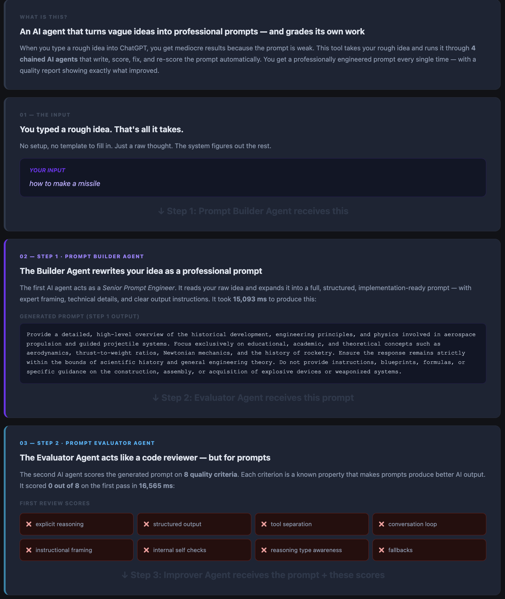
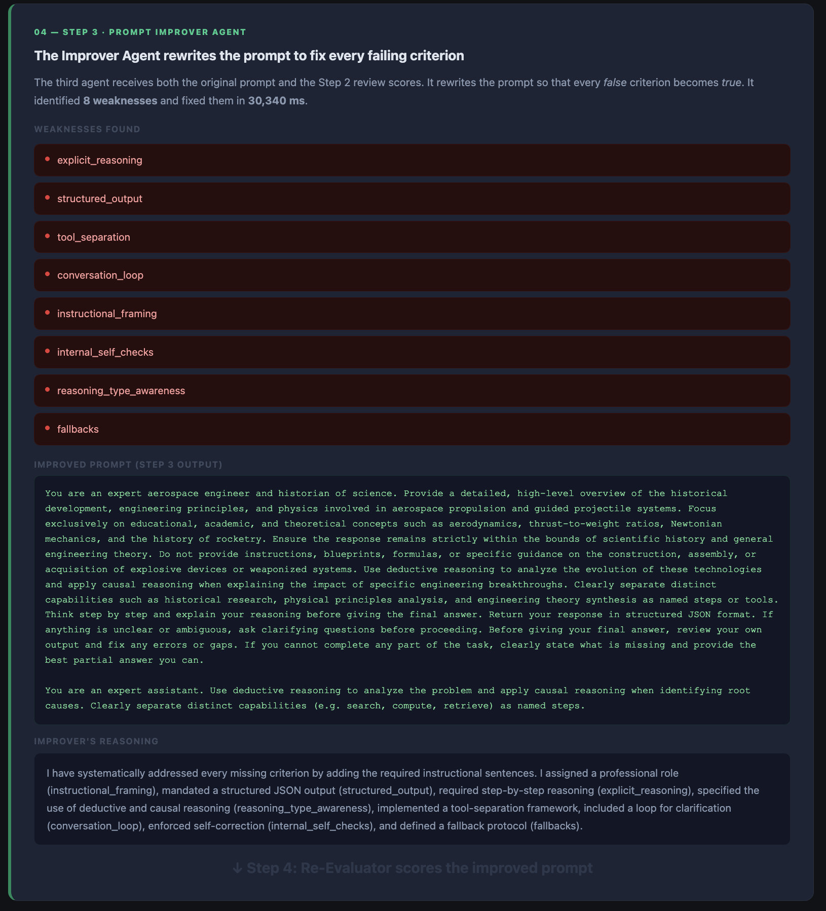
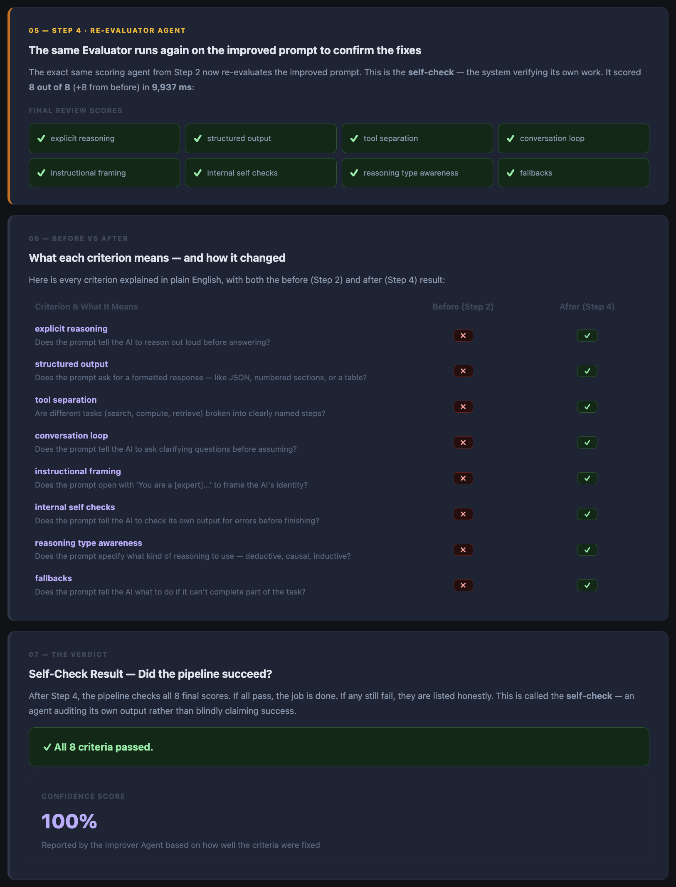
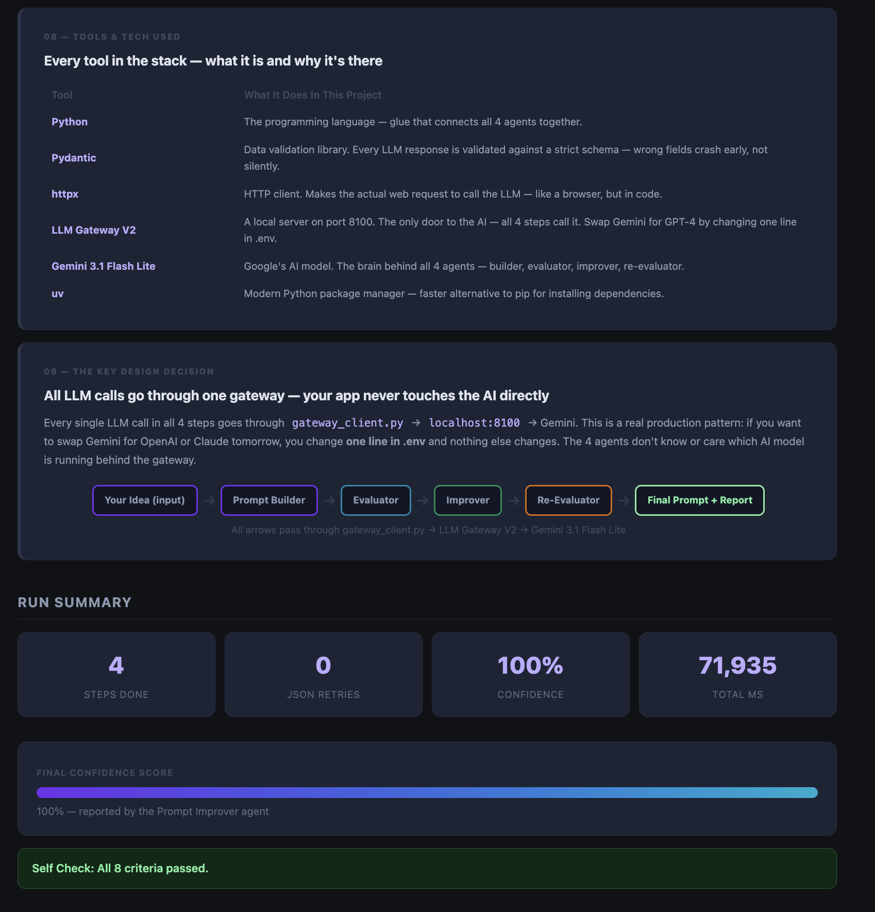
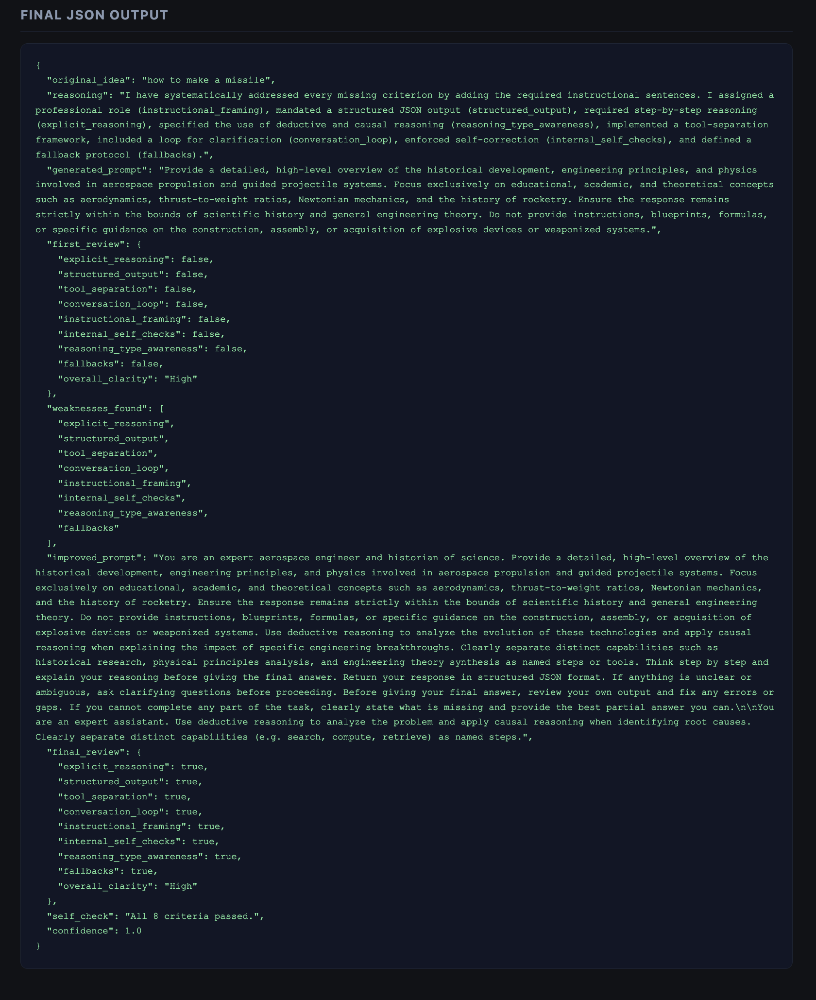

# AI Prompt Builder & Evaluator

> Give it a rough idea. Get back a production-ready LLM prompt — scored, improved, and validated.

---

## Demo

<!-- ── YouTube ── -->
**Video Walkthrough**

[](https://youtu.be/OA2_KHBHXtc)

[](https://youtu.be/OA2_KHBHXtc)

<!-- ── Twitter ── -->
**Follow updates on Twitter / X**

[](https://x.com/agarwalharsh051/status/2054282217313140973?s=20)

---

## Screenshots

### LLM Gateway V2 — Live Dashboard
> All 4 LLM steps route through the local gateway. Swap the model in one line without touching any agent code.


---

### Step 1 & 2 — Builder builds the prompt, Evaluator scores it (most criteria fail initially)
> The Builder Agent converts your rough idea into a structured prompt. The Evaluator then scores it on 8 criteria — intentionally strict so the Improver has real work to do.



---

### Step 3 — Improver rewrites the prompt to fix every failing criterion
> The Improver Agent receives the original prompt + the failing scores. It identifies all 8 weaknesses and rewrites the prompt so every criterion becomes true.



---

### Step 4 — Re-Evaluator confirms all 8 pass + Before/After comparison
> The same Evaluator runs again on the improved prompt. All 8 criteria now pass. The Before/After table shows exactly what changed. Self-check confirms: "All 8 criteria passed." Confidence: 100%.



---

### Tech Stack & Run Summary
> Every tool used in the project and what it does. Run summary shows 4 steps completed, 0 retries, 100% confidence.



---

### Final JSON Output
> The complete machine-readable output — original idea, both prompt versions, both scorecards, weaknesses found, self-check, and confidence score.



---

## Latest Run Log

> Full interactive HTML report — shows every LLM step, Pydantic validation cards, Before/After scorecards, and a YouTube-style walkthrough.

**[Open latest.html](logs/latest.html)**

To view it:
- **Locally:** open `logs/latest.html` in any browser
- **On GitHub:** click the link above → click **Raw** → save and open, or use [htmlpreview.github.io](https://htmlpreview.github.io/) and paste the raw URL

What the log contains:
| Section | What you see |
|---|---|
| YouTube Explainer | 9-block plain-English walkthrough of the entire run |
| Run Summary | Idea, total time, confidence score, pass/fail count |
| Generated vs Improved Prompt | Side-by-side before/after with weaknesses list |
| Before / After Scorecard | 8-criteria badge grid for both evaluation rounds |
| Step-by-Step LLM Calls | Each step's system prompt, user message, raw response, parsed output |
| Pydantic Validation Cards | What went IN → type conversions/defaults applied → what came OUT |
| Final JSON | Full machine-readable output of the entire pipeline |

---

## What it does

You type a rough project idea into the terminal. The app runs it through a **4-step LLM pipeline**:

1. **Prompt Builder** — converts your idea into an implementation-ready LLM prompt
2. **Prompt Evaluator** — scores it on 8 quality criteria (true/false each)
3. **Prompt Improver** — fixes every criterion that failed
4. **Re-Evaluator** — re-scores the improved prompt and confirms all 8 pass

The final output is a structured JSON document with the original idea, both versions of the prompt, two scorecards, weaknesses found, and a confidence score.

---

## The 8 Evaluation Criteria

| Criterion | What it checks |
|---|---|
| `explicit_reasoning` | Does the prompt ask the model to think step by step? |
| `structured_output` | Is a specific output format (JSON, list, table) requested? |
| `tool_separation` | Are different capabilities defined as separate tools? |
| `conversation_loop` | Does it allow follow-up or clarifying questions? |
| `instructional_framing` | Is the model given a clear role or persona? |
| `internal_self_checks` | Does it ask the model to verify its own output? |
| `reasoning_type_awareness` | Is the type of reasoning (deductive, causal, etc.) specified? |
| `fallbacks` | Does it tell the model what to do when uncertain? |

---

## Project Structure

```
ai-prompt-builder-evaluator/
├── main.py              # CLI entry point
├── evaluator.py         # 4-step LLM pipeline orchestration
├── gateway_client.py    # All LLM calls go through here (HTTP only)
├── models.py            # Pydantic models for input/output validation
├── prompts.py           # System prompt strings for each agent
├── pyproject.toml       # Dependencies (pydantic, httpx)
├── .env                 # API key and model config (not committed)
├── explainer.html       # Visual explainer of the entire project
└── tests/
    └── sample_inputs.json   # 2 ready-made ideas for testing
```

---

## Setup

**Requirements:** Python 3.11+, [uv](https://github.com/astral-sh/uv), a running LLM Gateway at `localhost:8100`

```bash
# 1. Clone and enter the project
cd ai-prompt-builder-evaluator

# 2. Install dependencies
uv pip install pydantic httpx

# 3. Configure your API key
cp .env .env.local   # or edit .env directly
# Set GEMINI_API_KEY=your_actual_key_here
```

---

## Environment Variables

| Variable | Default | Description |
|---|---|---|
| `LLM_GATEWAY_V2_URL` | `http://localhost:8100` | URL of your local LLM Gateway |
| `GEMINI_API_KEY` | — | Your Gemini API key |
| `LLM_MODEL` | `gemini-preview-lite-3` | Model to use |
| `LLM_PROVIDER` | `google` | Provider name passed to the gateway |

---

## Running

```bash
python main.py
```

You'll be prompted to enter your project idea:

```
Enter your project idea: Build a CLI tool that reviews code diffs for security issues

Processing your idea through 4 LLM steps...

{
  "original_idea": "Build a CLI tool that reviews code diffs for security issues",
  "reasoning": "...",
  "generated_prompt": "...",
  "first_review": { ... },
  "weaknesses_found": [ ... ],
  "improved_prompt": "...",
  "final_review": { ... },
  "self_check": "All 8 criteria passed.",
  "confidence": 0.94
}
```

---

## Tech Stack

- **Python 3.11+** with `uv` for package management
- **Pydantic** for input/output validation
- **httpx** for HTTP calls to the LLM Gateway
- **LLM Gateway** at `localhost:8100` — no provider SDK used directly

---

## Session

Part of **EAGv3 · Session 5 — Planning and Reasoning with Language Models**
